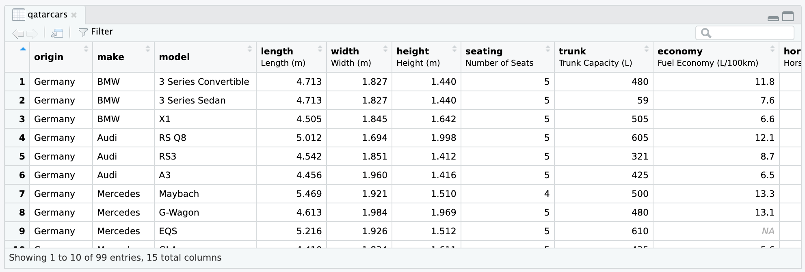
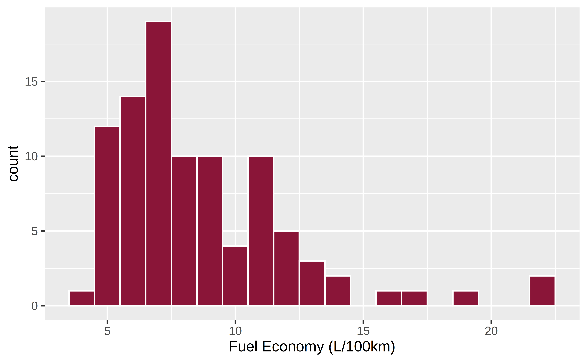
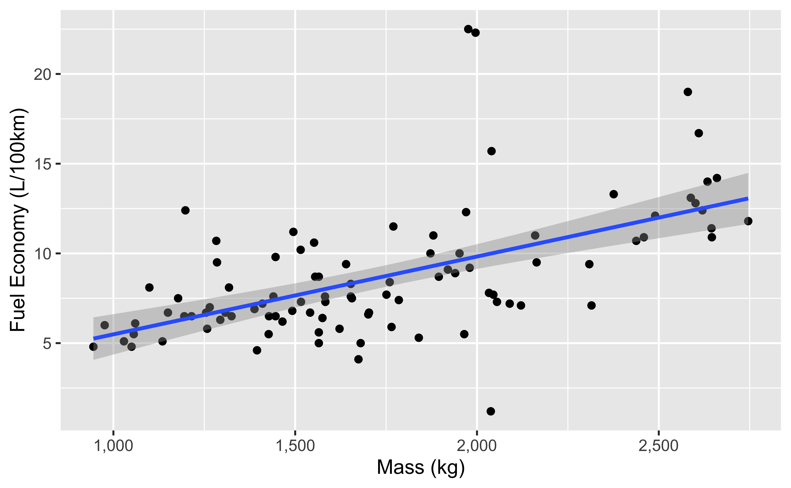
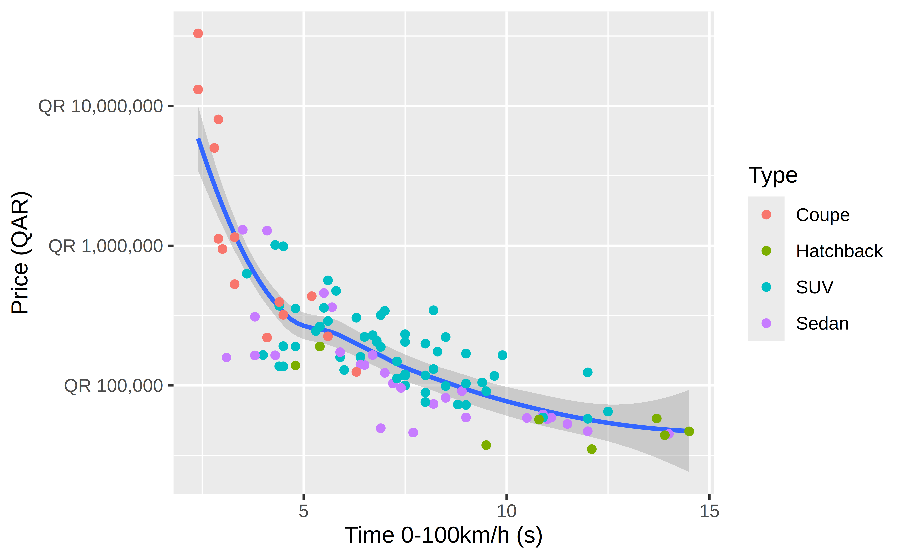

<!-- README.md is generated from README.qmd. Please edit that file -->


# qatarcars

<!-- badges: start -->

[](https://cran.r-project.org/package=qatarcars)
[](https://github.com/profmusgrave/qatarcars/actions/workflows/R-CMD-check.yaml)
<!-- badges: end -->

## Overview

Qatar Cars provides a more internationally-focused, modern cars-based
demonstration dataset. It mirrors many of the columns in `mtcars`, but
uses (1) non-US-centric makes and models, (2) 2025 prices, and (3)
metric measurements, making it more appropriate for use as an example
dataset outside the United States. It includes almost exactly the same
variables as the `mtcars` dataset:

-   `origin` (the country associated with the car brand)
-   `make` (the brand of the car, such as Toyota or Land Rover)
-   `model` (the specific type of car, such as Land Cruiser or Defender)
-   `length`, `width`, and `height` (all in meters)
-   `trunk` capacity (measured in liters)
-   fuel `economy` (measured in liters per 100 km)
-   `performance` (time in seconds to accelerate from 0 to 100km/h)
-   `mass` in kilograms
-   `price` in 2025 Qatari riyals
-   `type` (the type of the car, such as coupe, sedan, or SUV)
-   `enginetype` (electric, hybrid, or petrol)

The original data was compiled by [Paul
Musgrave](https://paulmusgrave.info/) in January 2025 and is mostly
sourced from [YallaMotors Qatar](https://qatar.yallamotor.com/). See
[Paul’s writeup of the background and purpose of the
data](https://open.substack.com/pub/musgrave/p/introducing-the-qatar-cars-dataset).

## Formats

The Qatar Cars data is available in several different formats:

-   **This {qatarcars} R package**. See below for complete details. Load
    like this:

    ``` r
    library(qatarcars)
    qatarcars
    ```

-   [**Plain text CSV
    file**](https://github.com/profmusgrave/qatarcars/blob/main/inst/extdata/qatarcars.csv).
    Use with any software.

-   [**Stata .dta
    file**](https://github.com/profmusgrave/qatarcars/raw/refs/heads/main/inst/extdata/qatarcars.dta).
    Load like this:

    ``` stata
    use "qatarcars.dta"
    list in 1/6
    ```

-   [**R .rds
    file**](https://github.com/profmusgrave/qatarcars/blob/main/inst/extdata/qatarcars.rds).
    Load like this:

    ``` r
    df <- readRDS("qatarcars.rds")
    head(df)
    ```

-   [**The QatarCars Python
    package**](https://github.com/prlitics/qatarcars). Install with
    `pip install qatarcars`, then load like this:

    ``` python
    from qatarcars import get_qatar_cars
    df = get_qatar_cars("pandas")  # or "polars"
    df.head()
    ```

## Installation

The released version of {qatarcars} is available on
[CRAN](https://CRAN.R-project.org):

``` r
install.packages("qatarcars")
```

You can also install the development version from
[GitHub](https://github.com/):

``` r
# install.packages("remotes")
remotes::install_github("profmusgrave/qatarcars")
```

## Usage

### Load data

Similar to other data-only R packages like
[{gapminder}](https://jennybc.github.io/gapminder/) and
[{palmerpenguins}](https://allisonhorst.github.io/palmerpenguins/), load
the data by running `library(qatarcars)`:

``` r
library(qatarcars)

qatarcars
#> # A tibble: 99 × 15
#>    origin  make     model   length width height seating trunk economy horsepower
#>    <fct>   <fct>    <fct>    <dbl> <dbl>  <dbl>   <dbl> <dbl>   <dbl>      <dbl>
#>  1 Germany BMW      3 Seri…   4.71  1.83   1.44       5   480    11.8        184
#>  2 Germany BMW      3 Seri…   4.71  1.83   1.44       5    59     7.6        386
#>  3 Germany BMW      X1        4.50  1.84   1.64       5   505     6.6        313
#>  4 Germany Audi     RS Q8     5.01  1.69   2.00       5   605    12.1        600
#>  5 Germany Audi     RS3       4.54  1.85   1.41       5   321     8.7        400
#>  6 Germany Audi     A3        4.46  1.96   1.42       5   425     6.5        180
#>  7 Germany Mercedes Maybach   5.47  1.92   1.51       4   500    13.3        612
#>  8 Germany Mercedes G-Wagon   4.61  1.98   1.97       5   480    13.1        585
#>  9 Germany Mercedes EQS       5.22  1.93   1.51       5   610    NA          333
#> 10 Germany Mercedes GLA       4.41  1.83   1.61       5   435     5.6        163
#> # ℹ 89 more rows
#> # ℹ 5 more variables: price <dbl>, mass <dbl>, performance <dbl>, type <fct>,
#> #   enginetype <fct>
```

> **Tip**
>
> If you have [{tibble}](https://tibble.tidyverse.org/) installed
> (likely as part of [the tidyverse](https://www.tidyverse.org/)),
> `qatarcars` will load as a tibble with nicer printing output; if you
> do not have {tibble} installed, the data will load as a standard data
> frame.

See `?qatarcars` for data documentation within R.

### Labels

Most columns in `qatarcars` are labeled:

``` r
attributes(qatarcars$economy)
#> $label
#> [1] "Fuel Economy (L/100km)"
```

These labels are visible in RStudio’s Viewer panel:



If you use {ggplot2} v4.0+, these variable labels will [automatically
appear in plot
labels](https://www.tidyverse.org/blog/2025/09/ggplot2-4-0-0/#labels):

``` r
library(ggplot2)

ggplot(qatarcars, aes(x = economy)) + 
  geom_histogram(binwidth = 1, fill = "#8A1538", color = "white")
```



## Examples

Fuel efficiency gets worse as cars get heavier:

``` r
ggplot(qatarcars, aes(x = mass, y = economy)) +
  geom_point() +
  geom_smooth(method = "lm") +
  scale_x_continuous(labels = scales::label_comma())
```



Some of these cars are really expensive, so logging the price is
helpful:

``` r
ggplot(qatarcars, aes(x = performance, y = price)) +
  geom_smooth() +
  geom_point(aes(color = type)) +
  scale_y_log10(labels = scales::label_currency(prefix = "QR "))
```


