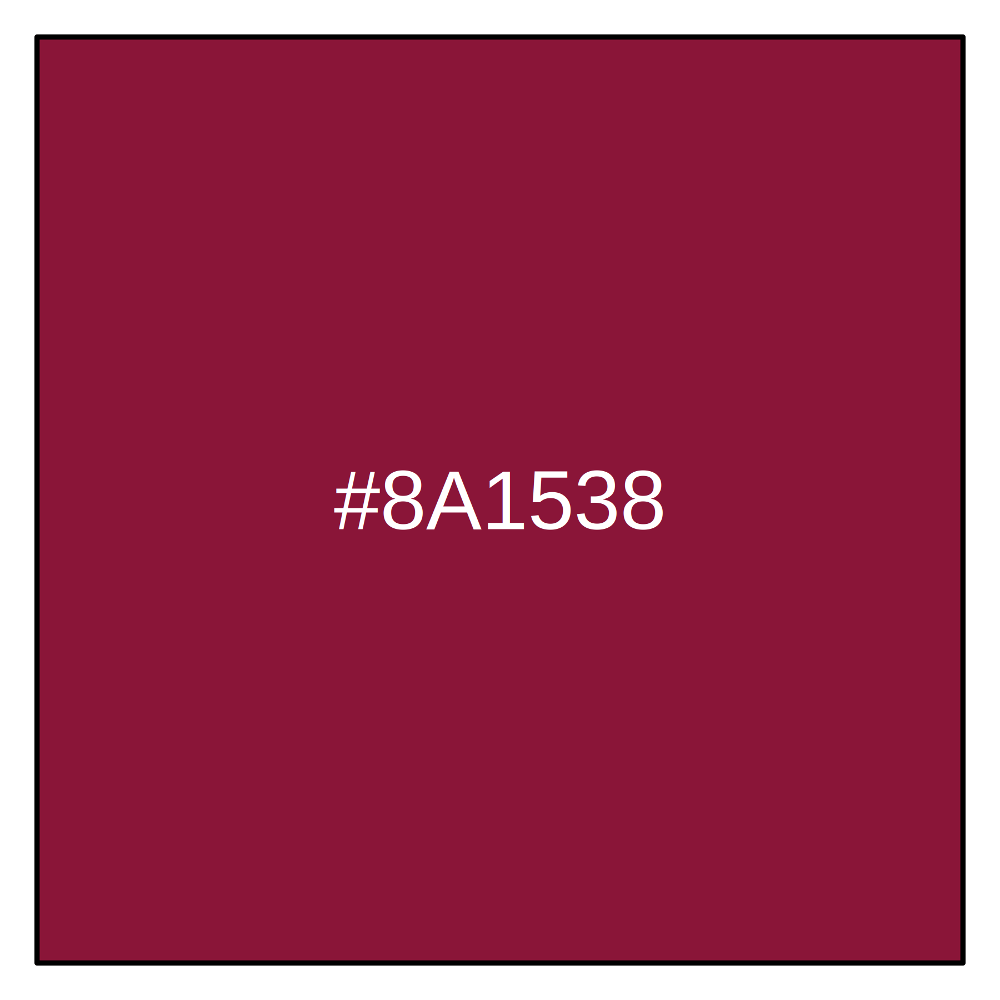
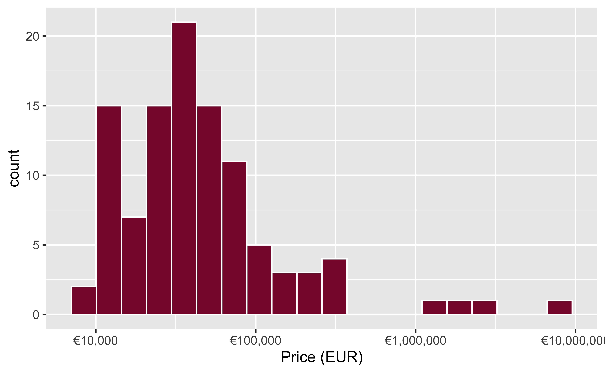
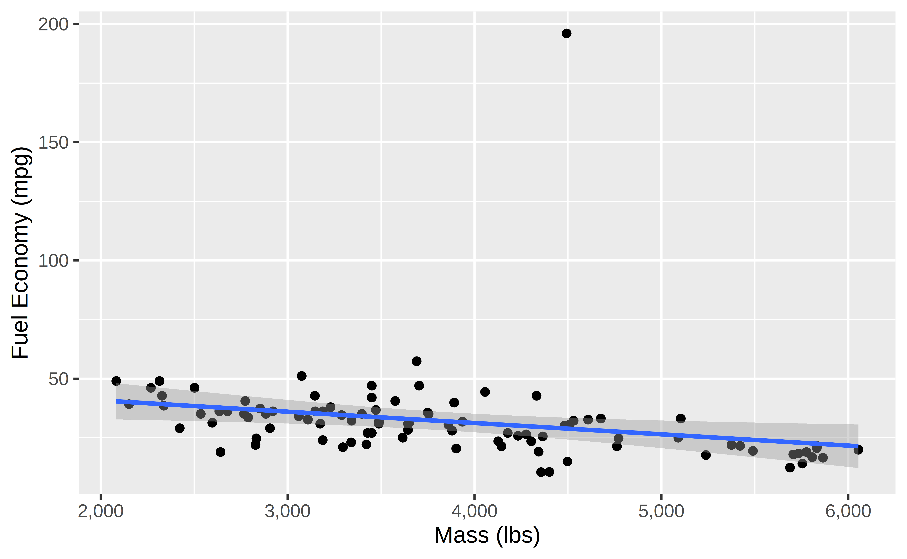
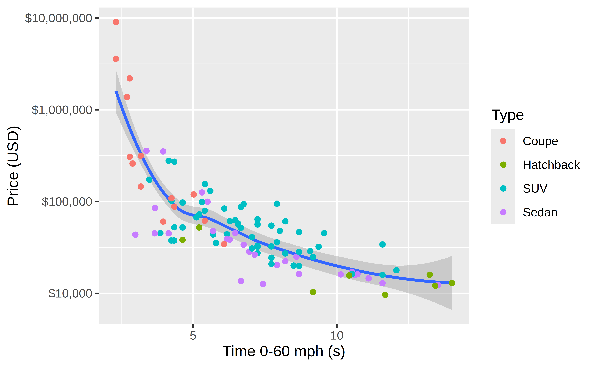

<!-- README.md is generated from README.qmd. Please edit that file -->


# qatarcars

<!-- badges: start -->

[](https://cran.r-project.org/package=qatarcars)
[](https://github.com/profmusgrave/qatarcars/actions/workflows/R-CMD-check.yaml)
[](https://lifecycle.r-lib.org/articles/stages.html#stable)
<br>
[](https://doi.org/10.1080/15512169.2025.2572320)

<!-- badges: end -->

## Overview

Qatar Cars provides a more internationally-focused, modern cars-based
demonstration dataset. It mirrors many of the columns in `mtcars`, but
uses (1) non-US-centric makes and models, (2) 2025 prices, and (3)
metric measurements, making it more appropriate for use as an example
dataset outside the United States. It includes almost exactly the same
variables as the `mtcars` dataset:

- `origin`: The country associated with the car brand
- `make` The brand of the car, such as Toyota or Land Rover
- `model` The specific type of car, such as Land Cruiser or Defender
- `length`, `width`, and `height`: Length, width, and height of the car
  (in meters)
- `seating`: Number of seats in the car
- `trunk`: Capacity or volume of the trunk (in liters)
- `economy`: Fuel economy of the car (in liters per 100 km)
- `horsepower`: Car horsepower
- `price`: Price of the car in 2025 Qatari riyals
- `mass`: Mass of the car (in kg)
- `performance`: Time to accelerate from 0 to 100 km/h (in seconds)
- `type`: The type of the car, such as coupe, sedan, or SUV
- `enginetype`: The type of engine: electric, hybrid, or petrol

The original data was compiled by [Paul
Musgrave](https://paulmusgrave.info/) in January 2025 and is mostly
sourced from YallaMotors Qatar. See [Paul’s writeup of the background
and purpose of the
data](https://open.substack.com/pub/musgrave/p/introducing-the-qatar-cars-dataset).

See this article for a more detailed description of the rationale for
and process of collecting the data:

> Paul Musgrave, “Defaulting to Inclusion: Producing Sample Datasets for
> the Global Data Science Classroom,” *Journal of Political Science
> Education*, 2025, 1–11,
> <https://doi.org/10.1080/15512169.2025.2572320>.

## Formats

The Qatar Cars data is available in several different formats:

- **This {qatarcars} R package**. See below for complete details. Load
  like this:

  ``` r
  library(qatarcars)
  qatarcars
  ```

- [**Plain text CSV
  file**](https://github.com/profmusgrave/qatarcars/blob/main/inst/extdata/qatarcars.csv).
  Use with any software.

- [**Stata .dta
  file**](https://qatarcars.georgetown.domains/qatarcars.dta). Load like
  this:

  ``` stata
  use "https://qatarcars.georgetown.domains/qatarcars.dta"
  list in 1/6
  ```

- [**R .rds
  file**](https://github.com/profmusgrave/qatarcars/blob/main/inst/extdata/qatarcars.rds).
  Load like this:

  ``` r
  df <- readRDS("qatarcars.rds")
  head(df)
  ```

- [**The QatarCars Python
  package**](https://github.com/prlitics/qatarcars). Install with
  `pip install qatarcars`, then load like this:

  ``` python
  from qatarcars import get_qatar_cars
  df = get_qatar_cars("pandas")  # or "polars"
  df.head()
  ```

## Installation

The released version of {qatarcars} is available on
[CRAN](https://CRAN.R-project.org):

``` r
install.packages("qatarcars")
```

You can also install the development version from
[GitHub](https://github.com/):

``` r
# install.packages("remotes")
remotes::install_github("profmusgrave/qatarcars")
```

## Usage

### Load data

Similar to other data-only R packages like
[{gapminder}](https://jennybc.github.io/gapminder/) and
[{palmerpenguins}](https://allisonhorst.github.io/palmerpenguins/), load
the data by running `library(qatarcars)`:

``` r
library(qatarcars)

qatarcars
#> # A tibble: 105 × 15
#>    origin  make     model   length width height seating trunk economy horsepower
#>    <fct>   <fct>    <fct>    <dbl> <dbl>  <dbl>   <dbl> <dbl>   <dbl>      <dbl>
#>  1 Germany BMW      3 Seri…   4.71  1.83   1.44       5    59     7.6        386
#>  2 Germany BMW      X1        4.50  1.84   1.64       5   505     6.6        313
#>  3 Germany Audi     RS Q8     5.01  1.69   2.00       5   605    12.1        600
#>  4 Germany Audi     RS3       4.54  1.85   1.41       5   321     8.7        400
#>  5 Germany Audi     A3        4.46  1.96   1.42       5   425     6.5        180
#>  6 Germany Mercedes Maybach   5.47  1.92   1.51       4   500    13.3        612
#>  7 Germany Mercedes G-Wagon   4.61  1.98   1.97       5   480    13.1        585
#>  8 Germany Mercedes EQS       5.22  1.93   1.51       5   610    NA          333
#>  9 Germany Mercedes GLA       4.41  1.83   1.61       5   435     5.6        163
#> 10 Germany Mercedes GLB 200   4.63  4.63   1.66       5   565     7.5        221
#> # ℹ 95 more rows
#> # ℹ 5 more variables: price <dbl>, mass <dbl>, performance <dbl>, type <fct>,
#> #   enginetype <fct>
```

> [!TIP]
>
> If you have [{tibble}](https://tibble.tidyverse.org/) installed
> (likely as part of [the tidyverse](https://tidyverse.org/)),
> `qatarcars` will load as a tibble with nicer printing output; if you
> do not have {tibble} installed, the data will load as a standard data
> frame.

See `?qatarcars` for data documentation within R.

### Currency conversions

Prices are stored as Qatari Riyals (QAR). At the time of data collection
in January 2025, the exchange rates between QAR and US Dollars and Euros
were:

- 1 USD = 3.64 QAR
- 1 EUR = 4.15 QAR

For convenience, this package includes functions for converting between
these three currencies based on January 2025 exchange rates:

- From QAR: `qar_to_usd()` and `qar_to_eur()`
- From USD: `usd_to_qar()` and `usd_to_eur()`
- From EUR: `eur_to_qar()` and `eur_to_usd()`

``` r
library(dplyr)

qatarcars |>
  mutate(
    price_eur = qar_to_eur(price),
    price_usd = qar_to_usd(price)
  ) |>
  select(origin, make, model, starts_with("price"))
#> # A tibble: 105 × 6
#>    origin  make     model            price price_eur price_usd
#>    <fct>   <fct>    <fct>            <dbl>     <dbl>     <dbl>
#>  1 Germany BMW      3 Series Sedan  164257    39580     45126.
#>  2 Germany BMW      X1              264000    63614.    72527.
#>  3 Germany Audi     RS Q8           630000   151807.   173077.
#>  4 Germany Audi     RS3             310000    74699.    85165.
#>  5 Germany Audi     A3              165000    39759.    45330.
#>  6 Germany Mercedes Maybach        1281000   308675.   351923.
#>  7 Germany Mercedes G-Wagon        1011500   243735.   277885.
#>  8 Germany Mercedes EQS             564500   136024.   155082.
#>  9 Germany Mercedes GLA             209500    50482.    57555.
#> 10 Germany Mercedes GLB 200         168997    40722.    46428.
#> # ℹ 95 more rows
```

### Unit conversions

Conversions between SI (International System) units (i.e. meters, grams,
liters) and US customary units (i.e. feet, pounds, gallons) are *not*
included as functions. This is a deliberate pedagogical choice. The data
is designed to be universally inclusive with SI units used by the
majority of the world. Users who work with US customary units should
convert them on their own.

See [the “Unit conversions” vignette](vignettes/unit-conversions.qmd)
for guidance and examples for making these different conversions, since
not all of the variables involve straightforward multiplication.

Another benefit of not including built-in conversion functions like
`m_to_ft()` is that this data can be used to teach learners how to write
R functions:

``` r
m_to_ft <- function(meters) {
  meters * (1 / 0.3048)
}

m_to_ft(100)
#> [1] 328.084
```

### Color

The official colors of the Qatari flag are [white and Pantone 1955 C, or
“Qatar maroon.”](https://en.wikipedia.org/wiki/Flag_of_Qatar) The hex
representation of this color is `⁠#8A1538`.⁠

For convenience, this is included as `qatar_maroon`:

``` r
qatar_maroon
#> [1] "#8A1538"

scales::show_col(qatar_maroon)
```



### Labels

Most columns in `qatarcars` are labeled:

``` r
attributes(qatarcars$economy)
#> $label
#> [1] "Fuel Economy (L/100km)"
```

These labels are visible in RStudio’s Viewer panel:


If you use {ggplot2} v4.0+, these variable labels will [automatically
appear in plot
labels](https://tidyverse.org/blog/2025/09/ggplot2-4-0-0/#labels):

``` r
library(ggplot2)

ggplot(qatarcars, aes(x = economy)) + 
  geom_histogram(binwidth = 1, fill = qatar_maroon, color = "white")
```


The various conversion functions also update the labels:

``` r
qatarcars |> 
  mutate(price_eur = qar_to_eur(price)) |> 
  ggplot(aes(x = price_eur)) +
  geom_histogram(bins = 20, fill = qatar_maroon, color = "white")  +
  scale_x_log10(labels = scales::label_currency(prefix = "€"))
```



## Examples

Fuel efficiency gets worse as cars get heavier:

``` r
ggplot(qatarcars, aes(x = mass, y = economy)) +
  geom_point() +
  geom_smooth(method = "lm") +
  scale_x_continuous(labels = scales::label_comma())
```


This is reversed when looking at miles per gallon. In SI units, low
`economy` values are good; in US customary units, high `economy` values
are good:

``` r
economy_conversion_factor <- 100 *
  3.785411784 / # liters in a gallon
  (0.3048 * 5280 / 1000) # kilometers in a mile

qatarcars |> 
  mutate(
    mass_lbs = mass / 0.45359237,
    economy_mph = economy_conversion_factor / economy
  ) |> 
  ggplot(aes(x = mass_lbs, y = economy_mph)) +
  geom_point() +
  geom_smooth(method = "lm") +
  scale_x_continuous(labels = scales::label_comma()) +
  labs(x = "Mass (lbs)", y = "Fuel Economy (mpg)")
```



Some of these cars are really expensive, so logging the price is
helpful:

``` r
ggplot(qatarcars, aes(x = performance, y = price)) +
  geom_smooth() +
  geom_point(aes(color = type)) +
  scale_y_log10(labels = scales::label_currency(prefix = "QR "))
```


Or in dollars:

``` r
qatarcars |> 
  mutate(
    price_usd = qar_to_usd(price),
    performance_mph = performance * (0.3048 * 5280 * 60 / 1000 / 100)
  ) |>
  ggplot(aes(x = performance_mph, y = price_usd)) +
  geom_smooth() +
  geom_point(aes(color = type)) +
  scale_y_log10(labels = scales::label_currency(prefix = "$")) +
  labs(x = "Time 0-60 mph (s)")
```


